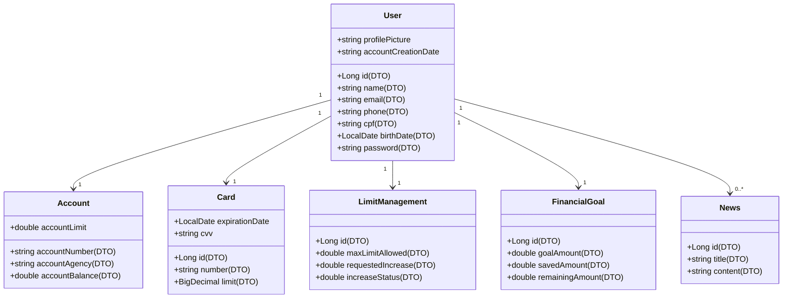

# 💳 API de Conta Bancária + Frontend

Projeto simples de uma aplicação web para gerenciamento de contas bancárias, com backend em Spring Boot e frontend em React + TypeScript.

---
## Diagrama de Classes
  

---
## 🧱 Arquitetura do Projeto

### 🔧 Backend - Spring Boot

**Tecnologias:**  
Java 17, Spring Boot, Swagger, PostgreeSQL

**Camadas:**

- `config/` – configurações (Swagger, CORS)
- `controller/` – endpoints REST
- `domain/`
  - `model/` – entidades (User, Account, Card, etc.)
  - `interfaces/` – interfaces de serviço (ex: IUserService)
  - `response/` – estrutura para retorno de erros
- `dto/` – objetos de transferência de dados
- `mapper/` – mapeamento entre entidades e DTOs
- `repository/` – interfaces JPA para banco de dados
- `service/` – regras de negócio
- `adapter/` – integração entre camadas
- `DatabaseInitializer/` – dados iniciais

**Entidades:**

- User
- Account
- Card
- FinancialGoal
- LimitManagement
- News

**Funcionalidades:**

- CRUD completo de usuários
- CRUD de metas financeiras
- Associação de conta e cartão ao usuário
- Retorno de notificações
- Tratamento de exceções com mensagens padronizadas

---

### 🖥️ Frontend - React + TypeScript

**Tecnologias:**  
React, TypeScript, Axios, React Router, TailwindCSS (ou styled-components)

**Páginas e Componentes:**

- Login e cadastro
- Dashboard com resumo do usuário
- Formulários para metas financeiras
- Lista de contas e cartões
- Notificações visuais

**Pastas principais:**

- `components/` – componentes reutilizáveis
- `pages/` – páginas da aplicação
- `services/` – comunicação com API
- `context/` – controle global (ex: login)
- `interfaces/` – tipagens dos dados

---

## 🚀 Release v0.0.0

📅 **Data:** 23/05/2025  
🎯 **Objetivo:** Entrega inicial com as funcionalidades básicas da aplicação.

**Inclui:**

- API REST com operações de usuário, conta, cartão e metas
- Frontend funcional com login, cadastro e dashboard
- Integração completa entre front e back
- Estrutura modular e escalável

**Rodar o projeto:**

**Backend:**
- Rodar Spring Boot (`localhost:8080`)
- Testar via Swagger (`/swagger-ui.html`)

**Frontend:**
```bash
npm install
npm run dev
