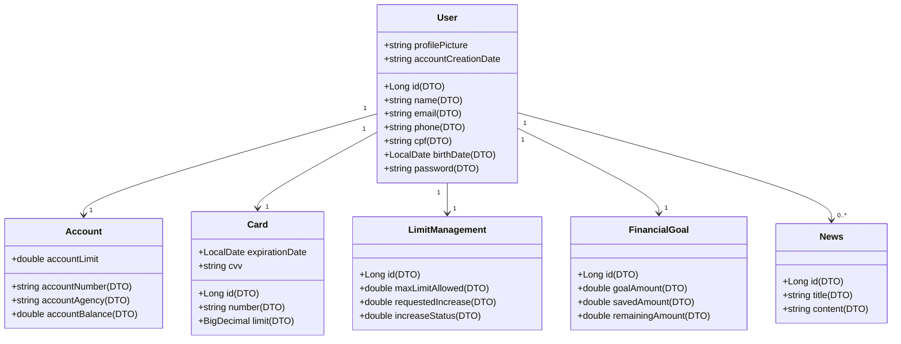
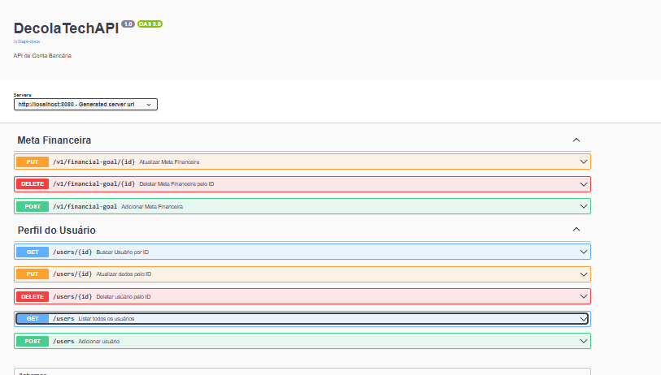

## API DE CONTA BANCÁRIA
Esta é uma API RESTful para gerenciamento de contas bancárias, desenvolvida com Spring Boot. Com ela, é possível registrar usuários, associar cartões a cada usuário, gerenciar limites, definir metas financeiras e enviar notificações.

## 💻 Tecnologias utilizadas para o desenvolvimento da aplicação :

 

  

## Diagrama de Classes
  

### **1. Estrutura do Projeto:**
-  **Config:** Configurações gerais do projeto, incluindo Swagger para documentação da API.  
-  **Controller:** Controladores REST para mapear os endpoints e manipular as requisições HTTP.  
-  **Domain:** Contém as interfaces de serviço, como `IFinancialGoalService` e `IUserService`, além da estrutura de resposta (`Response`) e modelos.  
- **Interfaces de Serviço:** `IFinancialGoalService`, `IUserService`  
-  **Response:** Estrutura usada para o tratamento e resposta de erros.  
-  **Model:** Contém as entidades do domínio, como User, FinancialGoal, etc.  
-  **DTO:** Objetos de transferência de dados.  
-  **Mapper:** Responsável por mapear as entidades para DTOs e vice-versa.  
-  **Repository:** Interfaces JPA para interação com o banco de dados.  
-  **Service:** Lógica de negócios e implementações dos serviços.  
-  **MethodsAdapter:** Adaptação de métodos para integrar a lógica de negócios com outras camadas.  
-  **DatabaseInitializer:** Responsável por inicializar dados no banco de dados, se necessário.
### **2. Entidades do Banco de Dados:**  
-  **User:** Representa um usuário no sistema e está associado a uma Account (conta bancária), um Card (cartão de crédito), uma lista de FinancialGoal (metas financeiras) e uma lista de News (notícias).  
-  **Account:** Contém informações sobre a conta bancária do usuário, como número da conta, agência, saldo e limite.  
-  **Card:** Contém informações sobre o cartão de crédito do usuário, como número e limite disponível.  
-  **FinancialGoal:** Representa as metas financeiras do usuário, como valores e datas para alcançar determinados objetivos financeiros.  
-  **LimitManagement:** Gerencia os limites financeiros do usuário, como aumento e redução de limites de crédito ou de conta.  
-  **News:** Representa notícias associadas ao usuário.  

### **2. Operações CRUD:**  
-  **Create (Criar):** Permite criar novos usuários no sistema com suas respectivas contas, cartões, metas financeiras e notícias.  
-  **Read (Ler):** Permite buscar usuários por ID e listar todos os usuários cadastrados.  
-  **Update (Atualizar):** Permite atualizar as informações de um usuário existente.  
-  **Delete (Deletar):** Permite deletar um usuário do sistema.  
-  **Get All Users:** Permite listar todos os usuários cadastrados.  
-  **Create FinancialGoal:** Permite criar uma meta financeira para um usuário.  
-  **Update FinancialGoal:** Permite atualizar a meta financeira de um usuário.  
-  **Delete FinancialGoal:** Permite deletar a meta financeira de um usuário.  

### **3. Tratamento de Exceções:**  
- 🚨 Utilização de uma estrutura de **Response** para tratamento de exceções e geração de respostas genéricas, caso ocorra algum erro específico.  

### **6. Railway:**  
- ☁️ **Railway:** Deployment da aplicação no **Railway**, um serviço de hospedagem na nuvem. Isso facilita o processo de deploy e gerenciamento da aplicação, permitindo que ela seja acessada de qualquer lugar.  

## Imagens da aplicação:
 
 
 
 ## 🚀 Deploy da API pelo Railway
 https://java-decolatech-api-production.up.railway.app/swagger-ui/index.html#/
